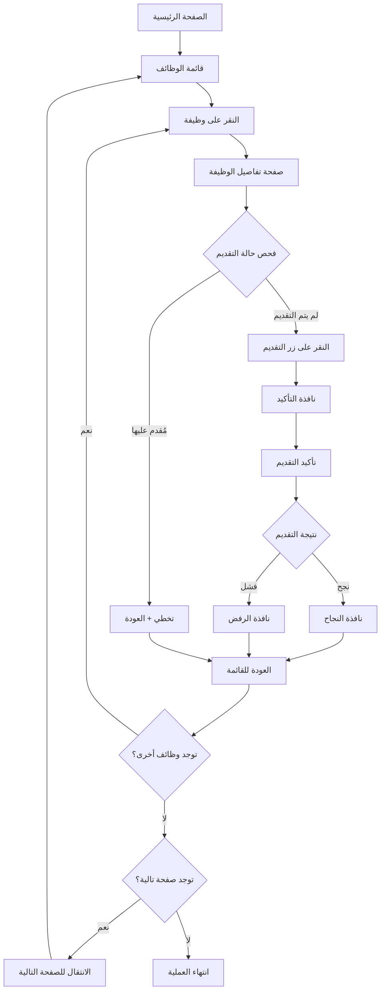

# 🎯 Blueprint شامل لموقع جدارات - الدليل الكامل


## 📋 ملاحظات للذكاء الاصطناعي المستقبلي

### 🧠 لمن سيكمل هذا المشروع:

#### أهم النقاط للفهم:
1. **الموقع ديناميكي**: جدارات يستخدم JavaScript مكثف، انتظر تحميل المحتوى
2. **المحددات متغيرة**: قد تتغير بنية HTML، استخدم محددات متعددة
3. **السرعة مهمة**: المستخدم لا يريد انتظار، لكن تجنب الكشف
4. **الأخطاء شائعة**: شبكة بطيئة، صفحات معطلة، نوافذ غير متوقعة

#### الملفات الحساسة:
- **content.js**: قلب الإضافة، يحتاج صيانة مستمرة
- **popup.js**: واجهة المستخدم، مهمة للتجربة
- **manifest.json**: أذونات وإعدادات، احذر من التغيير

#### أسلوب العمل المعي:
- **طلب HTML**: أطلب أجزاء من HTML للفهم
- **اختبار تدريجي**: ابدأ بميزة واحدة قبل التوسع
- **تفصيل المشاكل**: اشرح المشكلة بالتفصيل مع الكود
- **اقتراح بدائل**: دائماً اقترح حلول متعددة

#### الاختبارات المطلوبة:
```javascript
// اختبار أساسي سريع


### ⚡ نظام معالجة النوافذ المنبثقة:

#### أنواع النوافذ المكتشفة:

1. **نافذة التقييم الرقمي:**
   - تظهر أحياناً عند فتح تفاصيل الوظيفة
   - تحتوي على "تقييم تجربتك الرقمية"
   - **المعالجة**: إغلاق تلقائي بالنقر على زر الإغلاق

2. **نافذة تأكيد التقديم:**
   - تظهر عند النقر على زر "تقديم"
   - تحتوي على "هل أنت متأكد من التقديم..."
   - **المعالجة**: النقر على "تقديم" للتأكيد

3. **نافذة نتيجة التقديم:**
   - تظهر بعد التقديم
   - **نجح**: "تم التقديم بنجاح" ✅
   - **فشل**: "عذراً، لا يمكنك التقديم" ❌
   - **المعالجة**: إغلاق النافذة وتسجيل النتيجة

MIT License

Copyright (c) 2025 جدارات أوتو

Permission is hereby granted, free of charge, to any person obtaining a copy
of this software and associated documentation files (the "Software"), to deal
in the Software without restriction, including without limitation the rights
to use, copy, modify, merge, publish, distribute, sublicense, and/or sell
copies of the Software, and to permit persons to whom the Software is
furnished to do so, subject to the following conditions:

The above copyright notice and this permission notice shall be included in all
copies or substantial portions of the Software.

THE SOFTWARE IS PROVIDED "AS IS", WITHOUT WARRANTY OF ANY KIND, EXPRESS OR
IMPLIED, INCLUDING BUT NOT LIMITED TO THE WARRANTIES OF MERCHANTABILITY,
FITNESS FOR A PARTICULAR PURPOSE AND NONINFRINGEMENT. IN NO EVENT SHALL THE
AUTHORS OR COPYRIGHT HOLDERS BE LIABLE FOR ANY CLAIM, DAMAGES OR OTHER
LIABILITY, WHETHER IN AN ACTION OF CONTRACT, TORT OR OTHERWISE, ARISING FROM,
OUT OF OR IN CONNECTION WITH THE SOFTWARE OR THE USE OR OTHER DEALINGS IN THE
SOFTWARE.

jadarat-auto/
├── 📄 manifest.json          # إعدادات الإضافة (Manifest V3)
├── 🎨 popup.html             # واجهة المستخدم الرئيسية
├── ⚡ popup.js               # منطق واجهة المستخدم والتحكم
├── 🧠 content.js             # السكريبت الذكي الذي يعمل على الموقع
├── 🔧 background.js          # الخدمات الخلفية وإدارة الإضافة
├── 📁 styles/
│   └── 🎨 popup.css          # تصميم Cyberpunk المتقدم
├── 📁 icons/                 # الأيقونات (موجودة ولكن لم يتم رفعها)
│   ├── 🖼️ icon16.png         # أيقونة 16x16
│   ├── 🖼️ icon48.png         # أيقونة 48x48
│   └── 🖼️ icon128.png        # أيقونة 128x128
├── 📁 assets/                # ملفات إضافية
│   └── 🖼️ demori-logo.png    # شعار إضافي
└── 📖 README.md              # هذا الملف

## 📋 **خريطة العملية الكاملة (User Journey)**



---

## 🌐 **أنواع الصفحات وخصائصها**

### **1. 🏠 الصفحة الرئيسية (Home Page)**
**URL Pattern**: `https://jadarat.sa/`
```html
<!-- المؤشرات -->
- النص: "البحث عن الوظائف"
- النص: "الوظائف المتاحة"
- عدم وجود JobDetails في URL
```

**الهدف**: الانتقال لقائمة الوظائف
**Action**: البحث عن رابط `ExploreJobs`

---

### **2. 📋 صفحة قائمة الوظائف (Job List)**
**URL Pattern**: 
- `https://jadarat.sa/ExploreJobs`
- `https://jadarat.sa/Jadarat/?JobTab=1`

#### **🔍 مؤشرات التعرف:**
```html
<!-- العناصر المميزة -->
✅ روابط متعددة: a[href*="JobDetails"] (3 أو أكثر)
✅ عناصر pagination
✅ قائمة الوظائف: [data-list]
```

#### **📦 بنية بطاقة الوظيفة:**
```html
<div data-container="">
  <!-- اسم الشركة -->
  <div class="display-flex align-items-center margin-bottom-s">
    <a data-link="" href="#">
      <span data-expression="">شركة برايم ويف</span>
    </a>
  </div>

  <!-- عنوان الوظيفة + الرابط الرئيسي -->
  <div class="text-primary heading5">
    <a data-link="" href="/Jadarat/JobDetails?IsFromJobfair=false&JobFairId=&JobTab=1&Param=...">
      <span data-expression="" class="heading4 OSFillParent">أخصائي عمليات موارد بشرية</span>
    </a>
  </div>

  <!-- مؤشر "تم التقدم" (إذا كان مُقدم عليها) -->
  <div class="display-flex">
    
    <span class="text-primary">تم التقدم</span>
  </div>

  <!-- معلومات إضافية -->
  <div class="columns columns2">
    <div>المدينة: الرياض</div>
    <div>تاريخ النشر: 01/05/2025</div>
  </div>
</div>
```

#### **🎯 محددات البحث:**
```javascript
// روابط الوظائف
const jobLinks = 'a[href*="/Jadarat/JobDetails"]'
const jobLinks2 = 'a[data-link][href*="JobDetails"]'

// عنوان الوظيفة
const jobTitle = 'span.heading4.OSFillParent'
const jobTitle2 = '.heading4'

// مؤشر "تم التقدم"
const appliedIndicator = 'span.text-primary:contains("تم التقدم")'
const appliedIcon = 'img[src*="tickcircle.svg"]'

// الصفحة التالية
const nextPage = 'button[aria-label*="go to next page"]:not([disabled])'
```

---

### **3. 📄 صفحة تفاصيل الوظيفة (Job Details)**
**URL Pattern**: `https://jadarat.sa/Jadarat/JobDetails?...`

#### **🔍 مؤشرات التعرف الرئيسية:**
```html
<!-- الكتلة الأساسية -->
✅ [data-block="Job.PostDetailsBlock"]

<!-- محتوى مميز -->
✅ النص: "الوصف الوظيفي"
✅ النص: "نوع العمل" 
✅ النص: "الراتب"
✅ النص: "المؤهلات"
✅ النص: "المهارات"
✅ النص: "الرقم التعريفي"
```

#### **📦 البنية الكاملة لصفحة التفاصيل:**
```html
<div data-block="Job.PostDetailsBlock" class="OSBlockWidget">
  <!-- رأس الصفحة -->
  <div class="card margin-bottom-base">
    <!-- صورة الشركة + معلومات أساسية -->
    <div class="display-flex align-items-center">
      
      
      <div>
        <!-- الرقم التعريفي -->
        <div>الرقم التعريفي: <span>20250707113902889</span></div>
        
        <!-- عنوان الوظيفة -->
        <span class="heading5">أخصائي عمليات موارد بشرية</span>
        
        <!-- اسم الشركة -->
        <a><span>شركة برايم ويف</span></a>
        
        <!-- تاريخ انتهاء الإعلان -->
        <span>تاريخ نهاية الإعلان: 07/08/2025</span>
      </div>
    </div>

    <!-- زر التقديم الرئيسي -->
    <div class="text-align-right">
      <button data-button="" class="btn btn-primary btn-small auto-width OSFillParent" type="button">
        تقديم
      </button>
    </div>
  </div>

  <!-- محتوى التفاصيل -->
  <div class="post-details">
    <!-- المعلومات العامة -->
    <div class="card card-borderless-shadow">
      
      <!-- مسمى الوظيفة وفقا للعقد -->
      <label class="font-bold">مسمى الوظيفة وفقا للعقد</label>
      <span>اخصائي موارد بشرية</span>

      <!-- الوصف الوظيفي -->
      <label class="font-bold">الوصف الوظيفي</label>
      <span>تنفيذ الإجراءات والأنظمة والنماذج...</span>

      <!-- الواجبات والمهام -->
      <label class="font-bold">الواجبات والمهام الرئيسية</label>
      <span>تنفيذ الإجراءات والأنظمة...</span>

      <!-- الخبرة العملية -->
      <div class="card-radius">
        <span class="font-600">الخبرة العملية</span>
        <span>1 سنوات خبرة</span>
      </div>
    </div>

    <!-- الشريط الجانبي -->
    <div class="background-grey padding-m border-radius-xl">
      <!-- نوع العمل -->
      <div class="display-flex justify-content-space-between">
        <span class="font-600">نوع العمل</span>
        <span>دوام كامل</span>
      </div>

      <!-- الراتب -->
      <div class="display-flex justify-content-space-between">
        <span class="font-600">الراتب</span>
        <span>4,000الى8,000 ريال سعودي</span>
      </div>

      <!-- الجنس -->
      <div class="display-flex justify-content-space-between">
        <span class="font-600">الجنس</span>
        <span>ذكر</span>
      </div>

      <!-- المنطقة -->
      <div class="display-flex justify-content-space-between">
        <span class="font-600">المنطقة</span>
        <span>الرياض</span>
      </div>

      <!-- تاريخ بداية النشر -->
      <div class="display-flex justify-content-space-between">
        <span class="font-600">تاريخ بداية النشر</span>
        <span>08/07/2025</span>
      </div>
    </div>

    <!-- المؤهلات -->
    <div class="card card-borderless-shadow">
      <span class="font-600">المؤهلات</span>
      <div class="list-style-bullet">
        <span>البكالوريوس في الموارد البشرية</span>
      </div>
    </div>

    <!-- المهارات -->
    <div class="card card-borderless-shadow">
      <span class="font-600">المهارات</span>
      <div class="list-style-bullet">
        <span>جداول الإكسل - متوسط</span>
      </div>
    </div>

    <!-- اللغات -->
    <div class="card card-borderless-shadow">
      <span class="font-600">اللغات</span>
      <div class="list-style-bullet">
        <span>الانجليزية - متوسط</span>
      </div>
    </div>
  </div>
</div>
```

#### **🎯 محددات العناصر المهمة:**
```javascript
// التعرف على الصفحة
const pageIdentifier = '[data-block="Job.PostDetailsBlock"]'
const pageIdentifier2 = 'span.heading5' // عنوان الوظيفة

// زر التقديم
const submitButton = 'button.btn.btn-primary:contains("تقديم")'
const submitButton2 = 'button[data-button]:contains("تقديم")'

// عنوان الوظيفة
const jobTitle = 'span.heading5'

// حالة التقديم المسبق
const alreadyApplied = 'button:contains("استعراض طلب التقديم")'

// معلومات الوظيفة
const jobInfo = {
  company: 'a[data-link] span[data-expression]',
  salary: '.display-flex:contains("الراتب") span',
  location: '.display-flex:contains("المنطقة") span',
  workType: '.display-flex:contains("نوع العمل") span'
}
```

---

## 🔄 **النوافذ المنبثقة (Modals & Dialogs)**

### **1. 💬 نافذة التأكيد (Confirmation Dialog)**
**المحفز**: النقر على زر "تقديم"
```html
<div role="dialog" class="modal">
  <div class="modal-content">
    <span>هل أنت متأكد من التقديم على وظيفة: أخصائي عمليات موارد بشرية؟</span>
    
    <!-- أزرار -->
    <button>تقديم</button>  <!-- زر التأكيد -->
    <button>إلغاء</button>   <!-- زر الإلغاء -->
  </div>
</div>
```

**المحددات**:
```javascript
const confirmDialog = '[role="dialog"]:contains("هل أنت متأكد")'
const confirmButton = 'button:contains("تقديم")'
const cancelButton = 'button:contains("إلغاء")'
```

### **2. ✅ نافذة النجاح (Success Dialog)**
**المحفز**: نجاح التقديم
```html
<div role="dialog" class="modal">
  <div class="modal-content">
    <span>تم التقديم بنجاح على الوظيفة</span>
    <button>إغلاق</button>
  </div>
</div>
```

### **3. ❌ نافذة الرفض (Rejection Dialog)**
**المحفز**: رفض التقديم
```html
<div role="dialog" class="modal">
  <div class="modal-content">
    <span>عذراً، لا يمكنك التقديم على هذه الوظيفة</span>
    <span>السبب: الملف الشخصي لا يطابق شرط المؤهل التعليمي المطلوب</span>
    <button>موافق</button>
  </div>
</div>
```

**أسباب الرفض الشائعة**:
- `الملف الشخصي لا يطابق شرط المؤهل التعليمي المطلوب`
- `لا يطابق شرط الخبرة المطلوبة`
- `لا يطابق شرط العمر المطلوب`
- `لا يطابق شرط الجنس المطلوب`
- `انتهت فترة التقديم`

### **4. ℹ️ نافذة التقييم الرقمي (Digital Experience)**
**المحفز**: أحياناً عند فتح تفاصيل الوظيفة
```html
<div role="dialog" class="modal">
  <div class="modal-content">
    <span>تقييم تجربتك الرقمية</span>
    <button>×</button>  <!-- زر الإغلاق -->
  </div>
</div>
```

---

## 🎯 **خطوات العملية التفصيلية**

### **المرحلة 1: التحضير والفحص**
```javascript
// 1. فحص تسجيل الدخول
checkLoginStatus() // البحث عن "تسجيل الدخول"

// 2. تحديد نوع الصفحة
checkPageType() // home/jobList/jobDetails/unknown

// 3. التنقل المناسب
if (home) navigateToJobList()
if (jobDetails) startFromJobDetails()
if (jobList) startFromJobList()
```

### **المرحلة 2: معالجة قائمة الوظائف**
```javascript
// 1. انتظار تحميل الصفحة
await wait(4000)

// 2. اكتشاف الوظائف
const jobCards = getJobCards()
// - البحث عن: a[href*="JobDetails"]
// - استخراج العنوان من: .heading4
// - فحص "تم التقدم": img[src*="tickcircle.svg"]

// 3. معالجة كل وظيفة
for (jobCard of jobCards) {
  await processJob(jobCard)
}

// 4. الانتقال للصفحة التالية
await goToNextPage()
// البحث عن: button[aria-label*="go to next page"]:not([disabled])
```

### **المرحلة 3: معالجة وظيفة واحدة**
```javascript
// 1. النقر على رابط الوظيفة
await clickElementImproved(jobCard.link)

// 2. انتظار تحميل صفحة التفاصيل
await waitForNavigationImproved()

// 3. التعامل مع النوافذ المنبثقة
await handlePopups() // إغلاق نافذة التقييم الرقمي

// 4. فحص حالة التقديم
const alreadyApplied = await checkIfAlreadyAppliedInDetails()
// البحث عن: "استعراض طلب التقديم"

// 5. التقديم أو التخطي
if (alreadyApplied) {
  stats.skipped++
} else {
  const result = await applyForJob()
}

// 6. العودة لقائمة الوظائف
await goBackToJobList()
```

### **المرحلة 4: عملية التقديم**
```javascript
// 1. البحث عن زر التقديم
const submitButton = findSubmitButton()
// البحث عن: button.btn.btn-primary:contains("تقديم")

// 2. النقر على زر التقديم
await clickElementImproved(submitButton)

// 3. معالجة نافذة التأكيد
await handleConfirmationDialog()
// البحث عن: "هل أنت متأكد من التقديم"
// النقر على: button:contains("تقديم")

// 4. معالجة نافذة النتيجة
const result = await handleResultDialog()
// نجاح: "تم التقديم بنجاح"
// رفض: "عذراً، لا يمكنك التقديم"

// 5. إغلاق النافذة
// النقر على: button:contains("إغلاق") أو button:contains("موافق")
```

---

## 🛠️ **محددات HTML الشاملة**

### **📋 قائمة الوظائف**
```javascript
const JOB_LIST_SELECTORS = {
  // قائمة الوظائف
  jobList: '[data-list]',
  jobListAlt: '.list.list-group',
  
  // بطاقات الوظائف
  jobCards: 'a[href*="/Jadarat/JobDetails"]',
  jobCardsAlt: 'a[data-link][href*="JobDetails"]',
  
  // عناوين الوظائف
  jobTitles: 'span.heading4.OSFillParent',
  jobTitlesAlt: '.heading4',
  
  // مؤشرات التقديم المسبق
  appliedText: 'span.text-primary:contains("تم التقدم")',
  appliedIcon: 'img[src*="tickcircle.svg"]',
  
  // التنقل
  nextPage: 'button[aria-label*="go to next page"]:not([disabled])',
  prevPage: 'button[aria-label*="go to previous page"]:not([disabled])',
  activePage: '.pagination-button.is--active'
}
```

### **📄 تفاصيل الوظيفة**
```javascript
const JOB_DETAILS_SELECTORS = {
  // تحديد الصفحة
  pageIdentifier: '[data-block="Job.PostDetailsBlock"]',
  jobTitle: 'span.heading5',
  companyName: 'a[data-link] span[data-expression]',
  jobId: 'span:contains("الرقم التعريفي")',
  
  // زر التقديم
  submitButton: 'button.btn.btn-primary:contains("تقديم")',
  submitButtonAlt: 'button[data-button]:contains("تقديم")',
  
  // حالة التقديم المسبق
  alreadyAppliedButton: 'button:contains("استعراض طلب التقديم")',
  alreadyAppliedText: ':contains("تم التقديم على هذه الوظيفة")',
  
  // معلومات الوظيفة
  jobDescription: 'label:contains("الوصف الوظيفي") + span',
  workType: '.display-flex:contains("نوع العمل") span:last-child',
  salary: '.display-flex:contains("الراتب") span',
  gender: '.display-flex:contains("الجنس") span:last-child',
  location: '.display-flex:contains("المنطقة") span:last-child'
}
```

### **💬 النوافذ المنبثقة**
```javascript
const MODAL_SELECTORS = {
  // النوافذ العامة
  modal: '[role="dialog"]',
  modalAlt: '.modal',
  modalAlt2: '[class*="modal"]',
  
  // نافذة التأكيد
  confirmDialog: '[role="dialog"]:contains("هل أنت متأكد")',
  confirmButton: 'button:contains("تقديم")',
  cancelButton: 'button:contains("إلغاء")',
  
  // نافذة النتيجة
  successDialog: '[role="dialog"]:contains("تم التقديم بنجاح")',
  rejectionDialog: '[role="dialog"]:contains("عذراً، لا يمكنك التقديم")',
  
  // أزرار الإغلاق
  closeButton: 'button:contains("إغلاق")',
  okButton: 'button:contains("موافق")',
  xButton: 'button:contains("×")',
  
  // نافذة التقييم الرقمي
  digitalExperienceDialog: '[role="dialog"]:contains("تقييم تجربتك الرقمية")'
}
```

---

## 🔄 **أولويات المحددات (Fallback Strategy)**

### **للتعرف على صفحة التفاصيل:**
```javascript
// الأولوية 1: كتلة مخصصة
if (document.querySelector('[data-block="Job.PostDetailsBlock"]')) return 'jobDetails'

// الأولوية 2: عنوان الوظيفة + URL
if (document.querySelector('span.heading5') && url.includes('JobDetails')) return 'jobDetails'

// الأولوية 3: محتوى مميز
const detailsCount = countDetailsIndicators()
if (detailsCount >= 5 && url.includes('JobDetails')) return 'jobDetails'

// الأولوية 4: عدم وجود روابط متعددة
const jobLinks = document.querySelectorAll('a[href*="JobDetails"]')
if (jobLinks.length < 3 && url.includes('JobDetails')) return 'jobDetails'
```

### **للعثور على زر التقديم:**
```javascript
// الأولوية 1: محدد دقيق
let button = document.querySelector('button.btn.btn-primary[data-button]')
if (button && button.textContent.trim() === 'تقديم') return button

// الأولوية 2: فئة CSS
button = document.querySelector('button.btn.btn-primary')
if (button && button.textContent.includes('تقديم')) return button

// الأولوية 3: البحث الشامل
const allButtons = document.querySelectorAll('button')
for (const btn of allButtons) {
  if (btn.textContent.trim() === 'تقديم' && btn.offsetWidth > 0) return btn
}
```

---

## 📊 **جدول حالات النظام**

| الحالة | المؤشر | المحدد | الإجراء |
|--------|---------|--------|----------|
| **صفحة رئيسية** | URL: `jadarat.sa/` | `a[href*="ExploreJobs"]` | الانتقال للوظائف |
| **قائمة وظائف** | روابط متعددة | `a[href*="JobDetails"]` | معالجة الوظائف |
| **تفاصيل وظيفة** | `Job.PostDetailsBlock` | `button:contains("تقديم")` | التقديم |
| **مُقدم عليها** | `تم التقدم` | `img[src*="tickcircle"]` | التخطي |
| **نافذة تأكيد** | `هل أنت متأكد` | `button:contains("تقديم")` | التأكيد |
| **نجح التقديم** | `تم التقديم بنجاح` | `button:contains("إغلاق")` | الإغلاق |
| **رُفض التقديم** | `لا يمكنك التقديم` | `button:contains("موافق")` | الإغلاق |
| **صفحة تالية** | `go to next page` | `button[aria-label*="next"]` | التنقل |

---

هذا هو الـ **Blueprint الشامل** لموقع جدارات. بناءً على هذا، **أين تحديداً المشكلة التي تواجهها؟** 

- هل في **كشف نوع الصفحة**؟
- أم في **العثور على زر التقديم**؟  
- أم في **التنقل بين الصفحات**؟
- أم في **معالجة النوافذ المنبثقة**؟